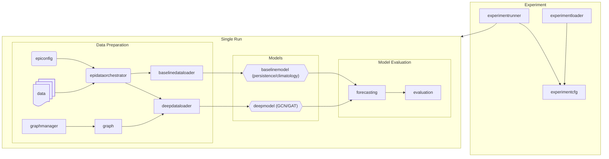

# GNN - based epidemiological - predictions
Systematic evaluation of graph structure choice in Graph Neural Network-based 
subnational epidemic forecasting. Companion codebase for [paper title].

## Project Structure

```
data/
notebooks/
src/
├── dataloading
│   ├── columnregistration
│   ├── dataloaders
│   │   ├── baselinedataloader
│   │   └── deepdataloader
│   ├── epiconfig
│   └── epidataorchestration
├── evaluation
├── experimenthandling
├── graphconstruction
├── models
│   ├── base
│   │   ├── basemodel
│   │   └── predictions
│   ├── baseline
│   │   ├── baselinemode.py
│   │   ├── climatology.py
│   │   └── persistence.py
│   ├── deep
│   │   ├── architectures
│   │   ├── deepmodel
│   │   └── strategies
│   └── utils.py
└── utils
    ├── colors.py
    ├── constants.py
    ├── exceptions.py
    ├── helpers.py
    ├── pathmanager.py
    ├── textformatting.py
    └── types.py
```

## Workflow


### Data Preparation

``EpiConfig`` is the main configuration class that guides the experiment being run. Features are selected, the setting (i.e. Germany at NUTS 1 / NUTS 2 / NUTS 3) is selected, and the number of timesteps ahead as well.

``EpiDataOrchestrator`` takes in the ``EpiConfig`` and produces a single data frame that all models will use further on. The ``EpiDataOrchestrator`` processes the data, aggregates it spatially, and temporally, if required to do so, and normalizes data as well. Within each step, data is stored at intermediate checkpoints on the class, and finally a transformed (normalized) data frame and a reverse-transformed data frame are available.

``DataBuilders`` take an ``EpiDataOrchestrator``, and make transform these into dataloaders, direct entities that the models load and work from. ``BaseLineDataBuilders`` are meant for the naive predictors, that work from the reverse-transformed data, and the GNNs use a ``GraphDataBuilder``.

``GraphManager`` creates and saves the graph structures that are used by the GNNs.

### Models and Evaluation

All models are subclasses of the ``BaseModel``, which creates a centralized ``PredictionManager``. The nature of this class is thus the same for each model. These are then evaluated together by ``Evaluator``.

### ExperimentHandling

``ExperimentConfig`` is the equivalent to ``EpiConfig`` for multiple runs. While ``EpiConfig`` would be defined for a single horizon, say the forecasting of influenza incidence rates at Germany NUTS 1 for 1 week ahead, the ``ExperimentConfig`` would be used to define how multiple ``EpiConfigs`` vary. Namely, we could define the varying-parameter to be ``horizon lead time`` ranging between 1-9 weeks, as to define an experiment with 9 distinct ``EpiConfig``s. 

``ExperimentRunner`` runs the ``ExperimentConfig`` and evaluates and saves the models.

``ExperimentLoader`` loads the ``ExperimentConfig`` and loads the models.

## Minimal running Example
